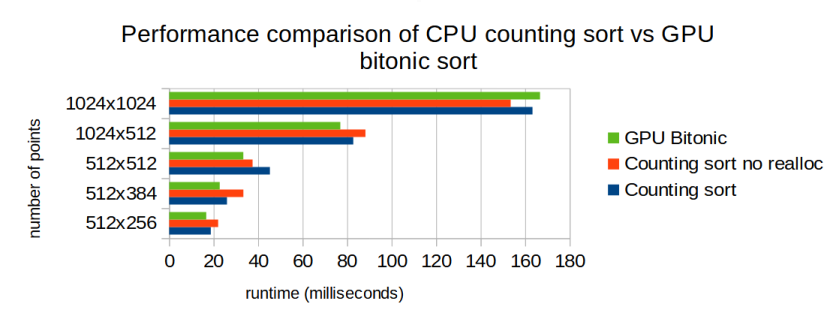

## Conclusion

The performance of GPU Bitonic sort [[1]] is roughly the same as CPU counting sort [[2]], at least in the context of rendering point clouds.

(hardware specs and measurements are in `results_laptop.txt` and more refined in `results_laptop_analysis.ods`).

## Visualization

## Motivation
For Gaussian Splatting [[3]], visualization requires rendering of transparent primitives, and to render them correctly, they must be sorted [[4]]. A WebGL implementation of Gaussian splatting viewer [[5]] uses counting sort on CPU, and I was wondering if a GPU sort would be better. A review article [[6]] suggested Bitonic sort, and provided parts of implementation, but I implemented the sort mostly from the wikipedia code and picture [[7]].

## Code Organization
The purpose was to measure performance in the context of the problem, as opposed to synthetic tests, as additional considerations (e.g. GL API calls/context switches) can affect the performance significantly. The context I chose was to render point clouds, but without the additional complexity of rendering actual gaussian splats, as this requires much trickier quad formation.

The CPU sorting with GPU point cloud visualization is implemented in [`sort_cpu.html`](sort_cpu.html) and the GPU bitonic sorting is implemented in [`sort_gpu_bitonic.html`](sort_gpu_bitonic.html). Additionally, a python implementation is in [`bitonic_net.py`](bitonic_net.py), as I used it to reimplement the algorithm in a form more amenable to GPU parallelization, and it is easier to debug such things in python rather than glsl.

## Next steps
1. Measure performance on other hardware I have: Desktop (i7/GTX3080) and Android phone (Samsung S10).
2. Better and more automated performance measurement so there's less manual work.
3. Detailed profiling in e.g. Nvidia Nsight to see if the GPU bitonic sort can be improved. Currently seems like memory bottleneck for each pass.

[1]: https://en.wikipedia.org/wiki/Bitonic_sorter

[2]: https://en.wikipedia.org/wiki/Counting_sort

[3]: https://repo-sam.inria.fr/fungraph/3d-gaussian-splatting/

[4]: https://shaderfun.com/2020/09/20/why-transparency-is-hard/

[5]: https://github.com/antimatter15/splat/

[6]: <https://developer.nvidia.com/gpugems/gpugems2/part-vi-simulation-and-numerical-algorithms/chapter-46-improved-gpu-sorting>

[7]: https://en.wikipedia.org/wiki/Bitonic_sorter#How_the_algorithm_works
